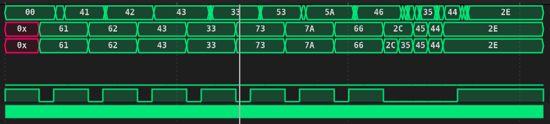

# Lab1 Awnsers

The reason we get errors on the last three bytes of data is because we dont give enough time to the circuit to receive and process the inputs and start to be out of sync with the `SendData()` function.

