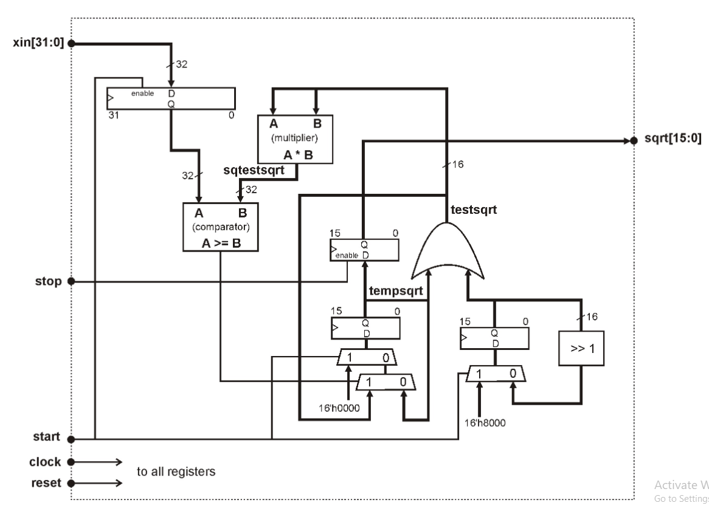
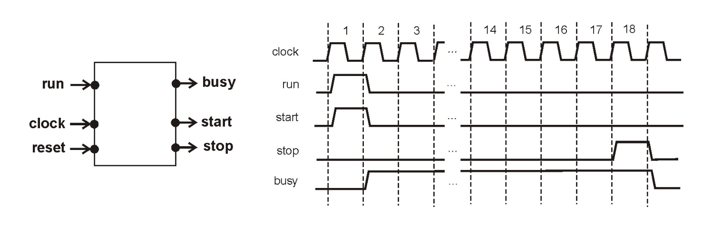

# Laboratory project 1 - V1.0

> FEUP M.EEC041 - Digital Systems Design 2021-2022
>
>jca@fe.up.pt
>M.EEC041 - Digital Systems Design
>
>2021/2022
>
>18 April 2022

## 1. Introduction

This project consists in implementing a sequential calculator of the square root for 32-bit unsigned integer numbers. The circuit must be built as a synthesizable Verilog module implementing the logic diagram shown in figure 1. The interface of the module is:

``` Verilog
module psdsqrt( 
     input clock,      // master clock rising edge 
     input reset,      // synch reset active high 
     input start,      // start a new square root, one clock pulse 
     input stop,       // load output register, one clock pulse 
     input [31:0] xin,   // operand, unsigned integer 32 bits 
     output reg [15:0] sqrt // sqrt( xin ), unsigned integer 16 bits 
       ) 
 ```



__Figure 1__ – RTL diagram of the sequential square root calculator.

## 2. Functional description

This circuit implements a sequential square root calculator for 32-bit integer numbers, producing the result as a 16-bit integer. The integer square root result is truncated to nearest integer not greater than the square root of `xin`. The function implemented by this circuit is functionally equivalent to the C code below:

```C
unsigned int xin, sqrtx;
sqrtx = (int) sqrt( (double) xin);
```

The algorithm builds the result iteratively from the most significant bit to the least significant bit. Iteration __`i`__ decides whether the bit `b[`__`i`__`]` is one or zero by comparing the square of a tentative result with that bit set (signals `testsqrt` and `sqtestsqrt==(testsqrt)2`) with the input argument  `xin`. If  `xin` is greater than sqtestsqrt then bit bi is set to one, otherwise it is reset back to zero.To execute a square root calculation, the input start must be set high during one clock cycle to load the input argument into the input register. Then the iterative process proceeds for 16 clock cycles. At the end of the iterative process, one additional clock is necessary with the input stop high to load the output register.

## 3. Implementation of the RTL code [40%]

The system must be implemented as a behavioral Verilog synthesizable module using
a single clock signal for all registers, active in the positive (rising) edge and a global
synchronous reset, active high. The activation of the reset signal must set all the
registers to zero.

## 4. Verification and automation of testbench [30%]

To verify this model you must adapt the testbench given and implement a convenient
verification program to verify the functionality of your code. The task execsqrt
already included in the testbench implements the correct sequence of signals start
and stop to perform calculation. You should improve the testbench in order to
automate the verification procedure.

## 5. Additional developments [30%]

### 5.1 Parametric Input Size [10%]

 Modify your module using one parameter `NBITSIN` to configure the number of bits for the operand  `xin` (and consequently for the result). The external controller that sequences the activation of the start and stop signals will use the same parameter to generate the appropriate timing for those signals, as the number of clock cycles is related to the number of bit of the result. The number of bits specified for the operand  `xin` must be even and between 4 and 64.

### 5.2 Rounding Mechanism [10%]

The iterative process implemented by this circuit truncates the integer result to
the floor of the square root of  `xin` (the nearest integer not larger than the real value
of `sqrt(xin)`. Modify your design to include a rounding mechanism, according to the
following rules and considering at most 4 bits for representing internally the
fractional part of the result:

- Round down if the fractional part of the square root is less than 0.5 (0.1000b)
- Round up if the fractional part is greater or equal to 0.5625 (0.1001b)
- Round to the nearest even integer if the 4-bit fractional part is equal to 0.5 (0.1000b)

Examples:

- sqrt(12) = 3.4641 -> round down to 3
- sqrt(13) = 3.6056 -> round up to 4
- sqrt(1057) = 32.512 = 10000.1000... -> round down to 32
- sqrt(4291) = 65.506 = 100001.1000... -> round up to 66

To obtain the fractional part of the result do the following:

1. `Input X * 2k` -> This is equivalent to increasing the number of bits of X by k and concatenating k zeros at the right of X.
2. The result computed by the circuit is `sqrt( X* 2k ) = sqrt( X ) * sqrt( 2k )` . If `X` is `N` bits long, the input operand has N+k bits and the result generated by the circuit has (N+k)/2 bits. Note that `sqrt(2k) = 2k/2`, thus `k` must be even in order to the division by `2k/2` being equivalent to shifting right by `k/2` bits.
3. Thus, the result will contain the integer part of the square root in the leftmost `N/2` bits and the fractional part in the `k/2` rightmost bits. These `k/2` bits will decide the operation for performing the rounding process described above.

### 5.3 Sequencial Controller [10%]

Build a sequential controller to generate the signals start and stop, according to the number of bit of the input operand specified by the parameter `NBITSIN`. The sequential controller must receive a single clock pulse in input run to start on calculation and generate the 3 output signals start, stop and busy, implementing the timing diagram shown in figure 2 (this is for a 16-bit output result)



__Figure 2__ - Timing Diagram for Sequencial Controller


----
----
# To do List
1. Implement Module
2. Change Test bench
3. Test!

## Notes
- The parameterization isnt going as planned.
    - There should be a value in the test bench that stores the value of bit to rearrange the whole circuit
- Too Much modules
    - There should be a way to compartmentalize each part of the circuit  but without making a bunch of modules

