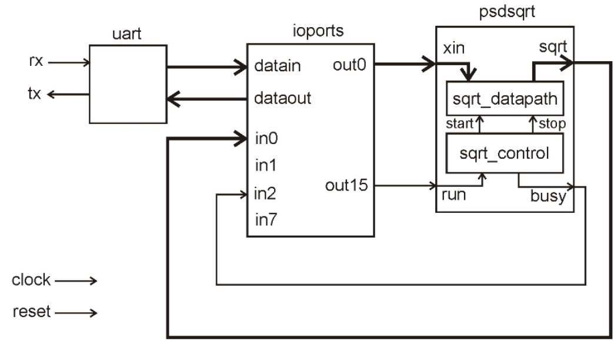
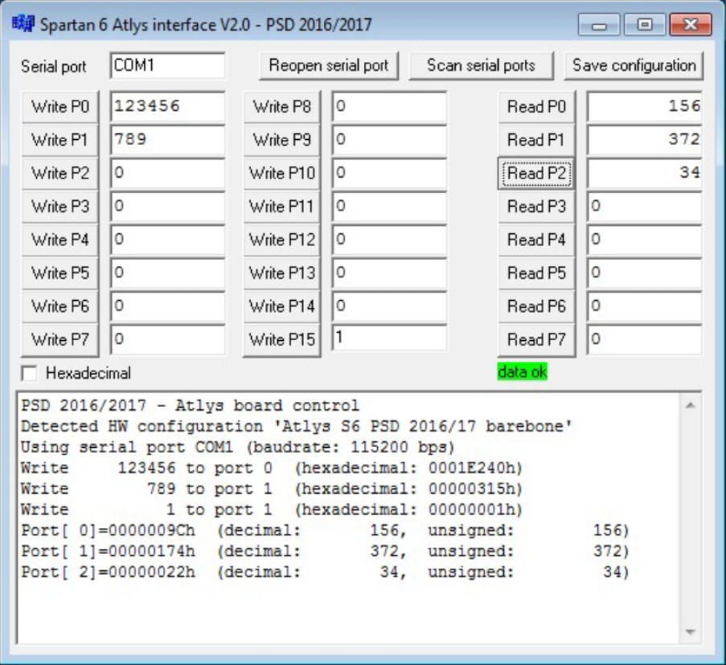

>
>FEUP - MEEC - M.EEC041 - Digital Systems Design  1/6 
>jca@fe.up.pt 
>M.EEC041 - Digital Systems Design  
> 
>2021/2022  
>

# Laboratory project 2 – V1.0 

In this laboratory the students will implement a custom digital system for a FPGA-based prototyping platform, going through all the design and verification stages. The project will start with an incomplete design that is missing the RTL code of the datapath of the square root calculator and the sequential controller required to control the datapath. These two modules  implement  a  input  to  output  bypass  just  to  allow  running  the  implementation processes, but do not implement the intended function. 
This guide assumes you have already developed the RTL code of the square root calculator and the sequential controller and verified successfully through behavioral simulation. This also assumes the Verilog code is correctly synthesizable, what can be verified during the synthesis stage. If you do not succeed correcting possible synthesis errors that do not allow you to proceed with the design flow, I can lend you a correct RTL model just to complete this project. 
 
This  exercise  is  based  on  the  XILINX  ISE  design  tools  that  still  support  the  FPGA  family Spartan 6 (the current suite of design tools do not support the FPGA Spartan 6). The tools are  freely  available  at  the  [XILINX  website](https://www.xilinx.com/products/design-tools/ise-design-suite/ise-webpack.html)  for  Windows  and  Linux.  XILINX  provides  a  free version of the design tools, supporting only a limited range of FPGA devices. This family of tools is referred as “Webpack” and this option must be selected during the installation and registration  for  a  license.  When  registering  at  the  XILINX  site  for  requesting  a  Webpack license, use your UP email address and identify yourself as a University student at UP. 
 
Either the 14.6 or 14.7 versions can be used for this lab. The installation in Windows 10 requires  a  manual  correction  in  some  DLL  files  and  works  fine  after  that  (instructions available in the course web page). Alternatively, XILINX provides a supported 14.7 version for  Windows  10  that  actually  is  a  Linux  installation  running  on  a  VirtualBox  virtual machine. This solution requires more disk space than a native installation on Windows (40 GB for the ISE 14.7@Virtual machine vs. 16 GB for 14.6 native installation).  
 
The verification stages will be done with the Verilog simulator integrated in ISE (iSim). This may  also  run  with  Icarus  Verilog  but  that  would  require  the  compilation  of  the  XILINX Verilog simulation libraries. The reference manual of the Atlys board can be found [here](https://reference.digilentinc.com/atlys/atlys/refmanual). 
 
## 1. Introduction 
---
The design provided for this project implements the block diagram shown in figure 1. The block  psdsqrt  (psdsqrt.v)  includes  the  same  datapath  designed  in  the  previous laboratory project (sqrt_datapath.v) and the sequential controller (sqrt_control.v) required to generate the start and stop signals used by the datapath. The modules uart (uart.v) and iports (ioports.v) implement a set of 16 output ports and 8 inputs ports to/from  a  digital  system  (32  bit  wide),  accessed  via  a  serial  port  that  will  connect  the FPGA board to a PC. The module ioports interprets a small set of commands to write data to a 32-bit output port and read data from a 32-bit input port. This system can be used with a basic Windows application (figure 2) that allows communicating with an application digital system connected to the input and output ports. 
 

Figure 1 – Simplified block diagram of the reference project. 

  
Figure 2 – The software application for interfacing with the Atlys board. 
 
In the design to be used in this lab, the module ioports connects to the sequential square root calculator: the operand xin is the data written to port 0, the square root calculation process starts by writing 1 to port 15 and the final result ( sqrt(X) ) is retrieved by reading from the input port 0 (note that this result will be available after 18 clock cycles that is a small fraction of the time needed to transmit a single byte through the serial port). The 5 general  purpose  push-buttons,  the  8  slide  switches  and  the  8  LEDs  (currently assigned to the 8 LSBits of operator xin) can be later used freely in your design. 

## 2. Installation of the reference project 
---
Download  the  archive  PSD-2122-LAB2.zip  and  extract  all  files  to  a  new  working directory. Do not install this into the desktop or any other directory containing spaces or other special characters (like accents) in the full pathname. The installed directory tree is: 
 
| Directory             |  Contents                                                       | 
| ----------------------|------------------------------------------------------------------|
| `./Matlab`            |  Matlab script for communication with the FPGA system            |
| `./doc`               |  Documentation (this guide and the manual of Atlys FPGA board)   |
| `./impl/sqrt`        |  ISE project directory (the project is already created)          |
| `./src/data`         |  Additional source files (User Constraints File - UCF)           |
| `./src/verilog-rtl`   |  RTL synthesizable Verilog modules                               |
| `./src/verilog-tb`    | Simulation Verilog modules                                       |
| `./sw/bin'`           |  Software application for accessing the FPGA system              | 
 
As the  simulation  processes will now  be  launched  from the  XILINX ISE  environment,  the simulations will run in the same directory as the implementation (`./impl`).  
 
This project provided is almost complete, just missing your RTL sources for the square root calculator and the sequential controller. All Verilog source files (either for synthesis and for simulation) are located in convenient directories. In a first stage you will just run the whole  verification  and  implementation  process,  and  at  the  end  experiment  the  final system in real silicon (i.e. in the FPGA). 
 
The six main stages to perform the implementation  of a digital system are: 
 
1.  __Functional  verification__: this will run a verification procedure by performing logic simulation,  using  a  simple  testbench  provided  in  the  reference  project (`./src/verilog-tb/s6base_tb.v`) 
2.  __RTL synthesis__: in this stage you will synthesize and compare the synthesis results for different optimization goals. 
3.  __Post-synthesis verification__: this task will repeat the logic simulation but using now  the logic-level netlist generated by the RTL synthesis. 
4.  __Physical implementation (map and place&route)__: this stage will build the physical organization of the logic blocks that implement the digital system and create the interconnections among them. 
5.  __Post-route (or timing) simulation__: this last simulation step uses the timing models for  the  logic  blocks  and  interconnections  to  simulate  the  system  with  the propagation delays estimated for the real circuit once implemented on the FPGA. This will be the most accurate simulation done in the ISE design flow. 
6.  __Testing  the  circuit__:  after  the  physical  implementation  you  will  implement  your system in the FPGA (or configure the FPGA) and experiment it using the Windows application or a Matlab script to send operands and read results. 
 
 
## 3. Implementation
---
Execute the application “ISE Design Suite 14.6” and close any project that may be open at startup  (by  default  this  tool  will  always  open  the  last  project).  Open  your  project  by selecting  the  file  `./impl/sqrt/sqrt.xise`.  The  module  s6base_top  (file `./src/verilog-rtl/s6base_top.v`)  is  the  top  level  Verilog  module  containing  the whole system represented in figure 1. In the “Hierarchy” pane (top-left) you can view the project hierarchy with all files associated to the design.  
 
In addition to the Verilog sources, the file s6base.ucf (ucf = user constraints file) contains implementation constraints, as the assignment of the design inputs/outputs to the physical FPGA pins (constraints “`NET ... LOC=`”) and a timing constraint specifying the minimum required  clock  period  (“`TIMESPEC...`”).  This  file  is  essential  for  the  implementation, otherwise  the  inputs  and  outputs  will  be  connected  to  random  FPGA  pins  with unpredictable results. 
  
## 3.1. Behavioural simulation 
---
The first major step in the design flow is to verify the whole circuit model at the functional level, as you already did in the previous labs. For this simulation you will use  a  simplified  testbench  (already  included  in  the  project)  that  simulates  the complete design described above, sending the operands and retrieving the results through the serial port. The simulation will use the ISim simulator integrated in the ISE design tools. 
 
In the Design window select the view “Simulation” and choose “Behavioural” for the  simulation  type.  In  the  project  hierarchy  view,  select  the  testbench  module (`s6base_tb`)  and  execute  the  process  “Simulate  Behavioural  Model”.  This  will launch  ISim and  run automatically for the default time of 1 us. Push “Run” (the play button) to run the simulation. 
 
Verify the simulation results in the output text window and the waveforms. Feel free  to  improve  the  testbench  and  add  the  additional  verifications  you  have developed in your project. 
 
## 3.2. RTL synthesis
---
In this stage you will synthesize a few versions of one module of your design and analyse  the  synthesis  results.  First,  in  the  design  window,  choose  the  view “Implementation”, select your square root calculator module and execute “Set as top module”, accessed with the right mouse button. This will mark this module as being the top level circuit for the implementation process, which is necessary to execute the RTL synthesis task only for this block.  
 
Run  the  process  “Synthesize  -  XST”  and  verify  the  warning  messages  generated during  the  synthesis  (hint  1:  the  table  “Clock  Information:”  lists  the  signals identified as clock signals or control signals of memory elements; hint 2: look for the word “latch” in the synthesis report). Identify and fix the issues in the source code related to these warnings. 
 
The RTL synthesis is driven by an extensive set of parameters that the designer can tune  to  meet  the  required  design  goals.  These  parameters  can  be  edited  by selecting “Process Properties” available for each implementation process (use the right-mouse button in “Synthesize - XST”). Verify the current configuration for the two  first parameters (optimization  goal  and  optimization  effort)  and  analyse  the synthesis results in the “Design summary” window. The most relevant results are the design area measured by the number of slice look-up tables (LUTs) and slice registers (flip-flops) and the estimated maximum clock frequency reported in the end and the synthesis log. 
 
By changing the first two synthesis parameters (optimization goal and optimization effort), try to synthesize the best implementation for this module, either in terms of  area  (minimize  the  number  of  LUTs  and  flip-flops)  and  in  terms  of  speed (maximize the clock frequency). 
 
 
## 3.3. Post-synthesis verification 
Select  again  the  module  s6base_top  as  the  top  level  design.  Choose  adequate synthesis optimization parameters and synthesise now the whole design. 
Select the simulation process “Post-Translate” and perform a logic simulation. This simulation  is  very  similar  to  the  described  in  section  3.1  although  now  you  will simulate a fully structural Verilog model generated by the synthesis process. Open the file `./impl/sqrt/netgen/translate/s6base_translate.v` and analyse its contents. Execute the simulation. 
 
## 3.4 - Physical implementation (Map and Place&Route) 
Execute now the process “Implement design”. This will run the Translate, Map and Place&Route  processes,  creating  the  most  accurate  model  of  the  circuit  that represents  the  physical  implementation  on  the  FPGA.  All  the  logic  blocks  and interconnections  will  be  now  annotated  with  propagation  delays  calculated  from the  models  of  the  logic  cells  and  the  VT  (voltage  and  temperature)  operating conditions. If this succeeds, the summary window will present the final utilization of the FPGA resources for the whole design and a list of detailed reports.  
 
Open the report “Post PAR static timing report” (window “Design summary” in the section “Detailed reports”) and verify the maximum clock frequency estimated for this implementation.  
 
After successful implementation you can open the FPGA low level editor and take a look  on  the  physical  organization  of  your  design  in  the  FPGA.  Open  “ImplementDesign -> Place & Route -> View/Edit Routed design”. 
 
## 3.5. Post-route verification 
Run a “Post-route” simulation, using the same procedure described in section 3.3. Prior to the simulation, a Verilog netlist will be generated and annotated with the logic and net delays defined in a SDF file (standard delay format). Both files are created in the directory `./impl/sqrt/netgen/par/`.  
 
Modify the testbench to increase the clock frequency to 30% above the maximum frequency reported in the static timing report. Running a timing simulation under this condition will probably fail, but only if the set of stimuli activates one of the logic paths that will not support the maximum clock frequency reported. 
 
 
## 3.6. FPGA configuration and experimentation (to be done in the lab) 
Execute  the  process  “Generate  programming  file”  to  generate  a  bitstream  file (`s6base_top.bit`) in the root project directory. This file is the final product of the FPGA design and contains the programming data to configure the FPGA logic blocks and interconnections with your circuit.  
 
Programming the FPGA in the Atlys board requires an application provided by the board vendor Digilent (Adept). Run this application, choose the bit file and execute “Program”.  
To  experiment  your  system  you  can  either  use  a  dedicated  Windows  application (`./sw/bin/S6-ATLYS.exe`) or MatLab function (`./Matlab/hwsqrt.m`) to send 
the operands, assert the run input and retrieve the results.  
 

