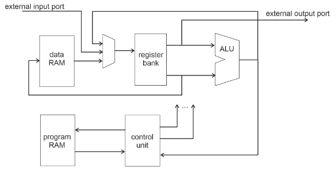
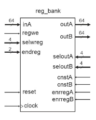
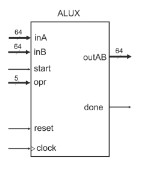
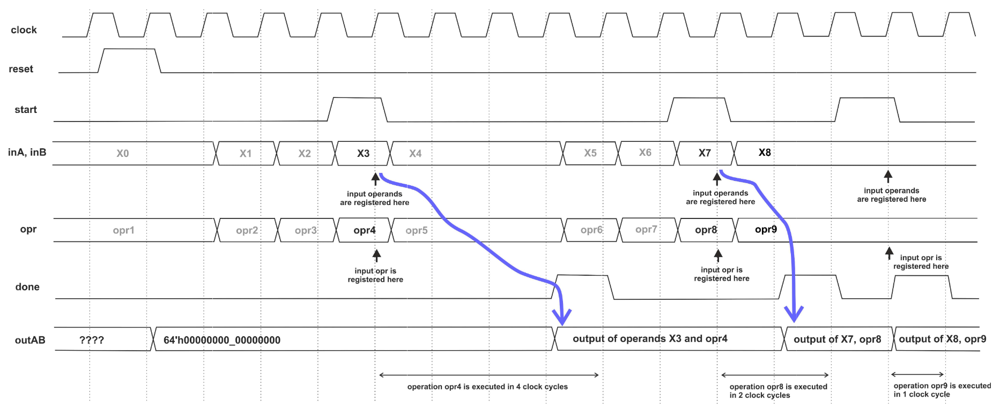

>
>FEUP - MEEC - M.EEC041 - Digital Systems Design  1/6 
>jca@fe.up.pt   
>M.EEC041 - Digital Systems Design  
>2021/2022 
>
 
## Laboratory project 3 – V0.3 May 2022 
 
# CPUX - microprocessor with native support for complex number arithmetic 
 
Revision history 
| Date         |                                Notes                          |   author     |
|--------------|---------------------------------------------------------------|--------------|
| May 17, 2022 | V0.1 Preliminary version with first spec of the register bank | jca@fe.up.pt |
| May 19, 2022 | V0.2 Corrected minor errors in the text. Added a brief description of the processor architecture | jca@fe.up.pt |
| May 23, 2022 | V0.3 Added the preliminary specification for the complex __ALU__ (new text is in blue) | jca@fe.up.pt |

 
## 1 – Introduction 
 
This  project  will  build  a  microprocessor  with  native  support  for  complex  number arithmetic. The main functional characteristics of the processor are: 
 
-  16 write/read registers, 64 bits (32 high bits real part, 32 low bits imaginary part) 
-  9 read-only registers with fixed complex constants (real part = -1, 0, +1, imaginary part = -1, 0 +1) 
-  Arithmetic and logic unit (____ALU____) operating in complex or real mode, integer two’s complement signed 
-  Three address register to register __ALU__ instructions ( `regdest <- regA op regB `) 
-  Synchronous 64 bit data RAM, supporting address space up to 16k (configurable) 
-  Support for configuring custom instructions by expanding __ALU__ operations 
 
The whole circuit must be synchronous with the positive edge of the clock signal and the global reset must be synchronous and active high. 
 
Figure  1  presents  a  simplified  block  diagram  of  the  processor.  The  register  bank implements  a  set  of  16  read/write  registers,  each  one  holding  a  complex  number represented by the real part in the high 32 bits and the imaginary part in the low 32 bits. A set of additional read-only registers provide 9 useful complex constants: `0+0j`, `0+1j`, `1+0j`, `1+1j`, `0-1j`, `-1+0j`, `-1-1j`, `1-1j`, `-1+1j`.  
 
The register bank provides two operands to the __ALU__ and receives one 64-bit result to be 
stored into one of the 16 read/write registers. The data input to the register bank can be 
the output result produced by the __ALU__, the data read from an external port or the data 
read from the data memory. 
 
Additionally to the register bank the processor includes a synchronous dual port data RAM 
with  1024x64  bit  (8  kByte).  The  access  to  the  data  RAM  is  done  only  with  load/store 
instructions to/from registers. The read/write operations to the RAM are synchronous with 
the master clock allowing simultaneous write and read operations. 
 
The __ALU__ implements the basic arithmetic and  logic operations on complex numbers and 
the  conversion  from  rectangular  to  polar  and  polar  to  rectangular  representation  of 
complex numbers. In addition to the complex arithmetic performed on data represented 
by  the  real  and  imaginary  components,  the  __ALU__  also  supports  the  multiplication  and 
division  operations performed independently for  the  high  32 bits and the  low 32 bits  of 
each data. Due to the diversity of the complexity of the operations implemented by the 
__ALU__,  the  number  of  clock  cycles  required  for  each  operation  is  variable  for  different 
operations.  The  operation  of  the  __ALU__  is  controlled  by  two  handshake  signals  start  and 
done. The complete specification of the __ALU__ operation will be detailed soon. 
 
>
>
>Figure 1 – Block diagram of CPUX 
 
 
## 2 - Register bank 
Implements a set of 16 write/read registers of 64 bits with one input port inA and two 
output  ports  outA  and  outB.  The  output  data  ports  outA  and  outB  are  driven  by  two 
additional registers, to allow operation in pipeline. When a read operation is performed 
and  the  input  reg_cnstA/B  is  set,  the  corresponding  output  port  is  loaded  with  a  pre-
defined complex constant selected by the output port register address seloutA/B. The set 
of complex constants read when reg_cnstA/B is set to 1 are `0+j0`, `1+j0`, `0+j1`, `1+j1`, `-1+j0`, 
`0-j1`, `-1-j1`, `-1+j1` and `1-j1`. The assignment of each constant to the output port register 
address  seloutA/B  is  implementation  dependent  and  can  be  chosen  to  minimize  the 
complexity of the circuit. 
 
The  write  and  read  operations  are  synchronous  with  the  clock.  The  writing  data  into  a 
register is set by the following inputs: 
- `inA`: the data to write 
- `regwen`: register write enable must be set to 1 
- `selwreg`: specifies the address (0 to 15) of the destination register 
- `endwreg`:  enable  data  write:  specifies  which  data  field  is  written  to  the  register, according to the following encoding: 
    - `2’b00`: writes both data
    - `2’b01`: writes only the high 32 bits
    - `2’b10`: writes only the low 32 bits
    - `2’b11`: swaps the high 32 bits with the low 32 
bits.

Data is read from the register bank to two independent ports in parallel, __outA__ and __outB__. 
These two ports are implemented by two registers that are loaded with the data specified by the read register control  signals:
- `seloutA/seloutB`: the register address to read into port A and B or the constant specifier if cnstA/cnstB is 1 
- `enrregA/enrregB`: read enable, set to 1 to enable loading output registers __outA/outB__ 
- `cnstA/cnstB`: set to zero to load output ports with data from registers, set to 1 to load the  output  ports  with  the  predefined  constants.  If  __cnstA/cnstB__  is  1  the  read  register address specifies the constant to load into the output ports. 
 
The interface of this module and the Verilog header of the RTL code is presented in figure 2. 
  
```verilog
 module reg_bank( 
  input         clock,  // Master clock, active in the posedge 
  input         reset,  // Master reset, synchronous and active high 
 
  //--- Data input port ----------------------------------------------------   
  input         regwe,  // Register write enable: set to 1 to write the register 
      //   selected by selwreg with the data at port inA 
  input  [63:0] inA,  // Data input 
  input  [ 3:0] selwreg,  // Select register index [0 to 15] to write data from port inA 
  input  [ 1:0] endreg,  // Data enable: 00-write both data fields 
      //              10/01-write only data field selected by 1’b0 
      //              11: swap high word and low word 
  //--- Data output ports --------------------------------------------------   
  output reg [63:0] outA,  // Data output A, registered 
  output reg [63:0] outB,  // Data output B, registered 
  input  [ 3:0] seloutA,  // Select register index [0 to 15] to output port outA 
  input  [ 3:0] seloutB,  // Select register index [0 to 15] to output port outB 
  input         cnstA,  // Define whether the output ports A and B are loaded with 
  input         cnstB,  //   the contents of the register bank or a fixed constant 
  input         enrregA,  // Read enable to output register outA (loads output register) 
  input         enrregB  // Read enable to output register outB (loads output register) 
    ); 
``` 
>
>
>Figure 2 – Interface signals of the register bank (module reg_bank.v) 
 
 
## 3 – Arithmetic and logic unit for complex numbers (module __ALUX__) 
Module  __ALUX__  implements  a  set  of  functional  units  for  performing  arithmetic  and  logic operations on complex numbers. The __ALUX__ receives two 64-bit operands and produces one 64-bit  result.  The  operands  and  the  result  are  composed  by  two  32-bit  fields  (signed integer),  referred  to  by  RE  (the  high  32  bits)  and  IM  (the  low  32  bits).  For  complex arithmetic operations, RE and IM represent the real and imaginary parts a complex data and for real arithmetic operations, the RE and IM fields are treated as two independent integers. 
 
The interface of the __ALUX__ is presented in figure 3. Signals inA and inB are the two 64-bit operands  and  outAB  is  the  64-bit  result.  The  execution  of  the  arithmetic  and  logic operations by module __ALUX__ is controlled by two handshake signals start and done and a 5-bit control word, opr, defining the operation to execute.  
 
The __ALUX__ operation starts when signal start is set to 1 and the result is ready at output outAB when signal done is asserted. Both handshake signals are set to 1 during a single clock  cycle.  After  initiating  an  operation,  the  input  start  must  be  ignored  until  the operation is completed (done set to 1).  
The operations implemented by module __ALUX__ require a variable number of clock cycles, as illustrated in the timing diagram of figure 4. 
 
The initial set of operations to be implemented are described in next table, including the indication of the maximum duration of each operation, in clock cycles: 

| opr index | Operation: outAB <= ...| Max clocks |                             | 
|-----------|------------------------|------------|-----------------------------|
|     0     |            A           |      1     |                             |  
|     1     |            B           |      1     |                             | 
|     2     |          A + B         |      2     | Complex / real addition     |
|     3     |          A – B         |      2     | Complex / real subtraction  |
|     4     |          A * B         |      6     | Complex multiplication      | 
|     5     |          A / B         |     40     | Complex division            | 
|     6     | RE(A) * RE(B), IM(A) * IM(B) | 4 | Real multiplication |
|     7     | RE(A) / RE(B), IM(A) / IM(B) | 34   | Real division |
|     8     |         A == B         |      1     |  Equality compare  |
|     9     |{ MOD(A), ANG(A) }      |     38     | Conversion to polar coords, operand A |
|    10     |{ MOD(B), ANG(B) }      |     38     | Conversion to polar coords, operand B | 

>
>
>Figure 3 – Interface of the complex __ALUX__ (module `alux.v`) 
 
>
>
>Figure 4 – __ALUX__ timing diagram 
 
